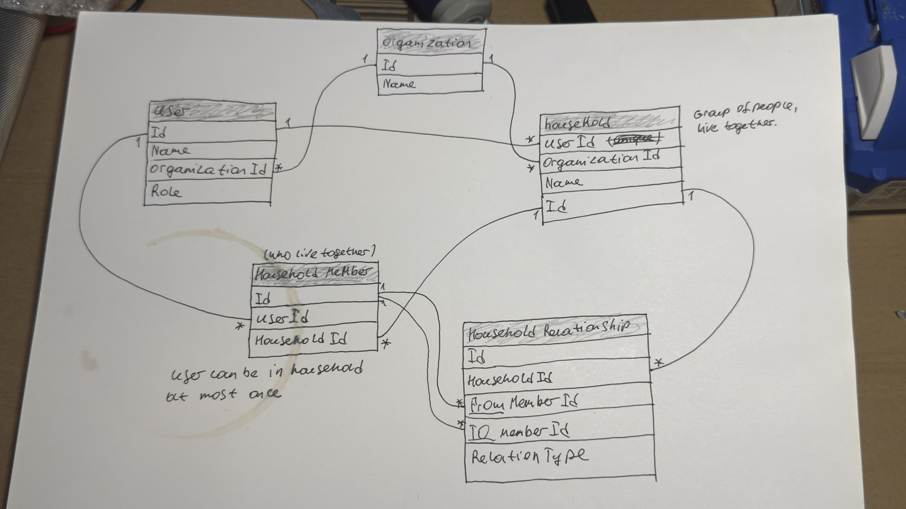

instruction: 
 PostgreSQL (Docker):
 docker compose up -d

 ```bash
# generate the migration (writes files under MemberWorks.Persistence/Migrations)
dotnet ef migrations add InitialCreate \
  --project MemberWorks.Persistence \
  --startup-project MemberWorks.Api

# apply it to the running Postgres container
dotnet ef database update \
  --project MemberWorks.Persistence \
  --startup-project MemberWorks.Api
```

API — either run config in Rider (MemberWorks.Api), or:
command: 
dotnet run --project MemberWorks.Api   


ui part - Angular:

cd UI/memberworks-web && npm install && npm start 
